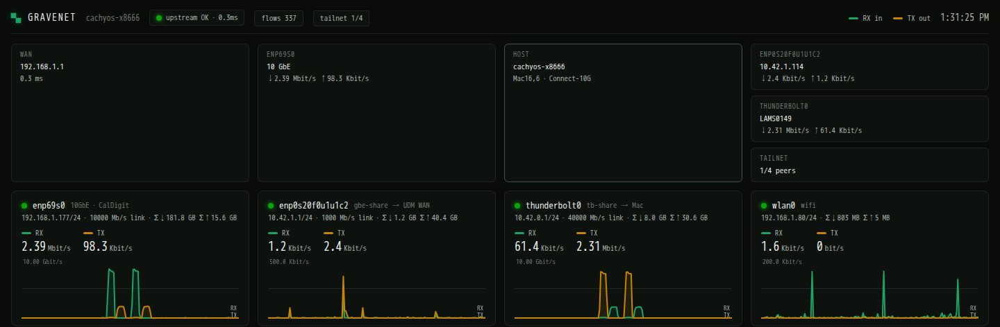

# gravedecay

[](https://github.com/projectmushroom/gravedecay/actions/workflows/ci.yml)


**Turn any Linux box into an always-on AI dev appliance. The box never sleeps — your agents work the graveyard shift.** 🪦

gravedecay converts a spare machine (old laptop, mini PC, Steam Machine) into a
personal, tailnet-only AI development server: your repos, databases, and coding
agents live on it 24/7, while your laptops, phones, and tablets become thin
clients. It presents as a focused dev box by default. If that machine also
games, an optional gaming layer adds mode switches that freeze your agent
sessions and free RAM/GPU until you're done. Stock SteamOS enables that layer
on first raise; every other system leaves it off unless you opt in.

```
        ┌─────────────────────────────── the box ─────────────────────────────────┐
        │                                                                         │
        │  systemd (native, no containers)           docker (backing svcs only)   │
        │  ├─ gravedecay.service  dashboard :4712    ├─ postgres  127.0.0.1:5432  │
        │  ├─ t3code.service      web UI    :4711    ├─ redis     127.0.0.1:6379  │
        │  ├─ gravedecay-term     ttyd      :4713    └─ playwright browsers       │
        │  ├─ gravedecay-net      flow mon  :4714                                 │
        │  └─ tmux -L agents      persistent claude/codex/shell sessions          │
        │                                                                         │
        │  /srv/dev/{repos,agents,docker,config,logs,scripts,backups,docs}        │
        │  grave <cmd> — one CLI to rule the box                                  │
        └────────────────────────────┬────────────────────────────────────────────┘
                                     │ tailscale serve — ONE https origin:
                                     │   /grave = gravedecay  / = T3  /term = terminal  /net = gravenet
                     ┌───────────────┼───────────────┐
                  laptop           iPhone          iPad
                     └── gravedecay PWA (/grave/) — THE entry point ──┘
```


## Design principles

1. **Native first.** Agent CLIs, the web UI, the terminal, and the dashboard
   run as plain systemd services on the host — agents need real files, real
   processes, real builds. Docker is only for backing services.
2. **Tailnet-only.** Everything binds `127.0.0.1`; the only ways in are
   Tailscale (`tailscale serve` for the HTTPS origin, Tailscale SSH as
   fallback) and key-only sshd. Firewall is default-deny. No port
   forwarding, ever.
3. **Dev box first; gaming when needed.** Non-SteamOS hosts default to a clean
   dev-only dashboard. `grave gamewatch on` adds the gaming switches and
   automatic detection on any supported host. `grave gaming` then frees
   RAM/GPU while remote access stays up: 🧊 freeze sessions in place or ☠️ kill
   them for maximum headroom.
4. **Agent-operated.** The scripts do the deterministic 90 %; a coding agent
   (Claude Code, Codex, …) handles the box-specific 10 %. `AGENTS.md` is the
   playbook you point your agent at.
5. **Everything is a file under `$GRAVE_ROOT`** (default `/srv/dev`) — repos,
   configs, logs, backups, docs. Snapshot-friendly (btrfs+snapper supported,
   not required).
6. **Doctor is the contract.** Every invariant the platform relies on is a
   `grave doctor` check; a quirk doctor can't see will silently regress.

## Quickstart

### The agent way (recommended)

SSH into the fresh box, install your coding agent, and say:

> Clone `https://github.com/projectmushroom/gravedecay`, read `AGENTS.md`,
> and raise this box. Host profile: `<generic | t2-macbook | steam-machine>`.

The agent runs the ritual, fixes distro quirks, walks you through the two
interactive steps (Tailscale login, T3 pairing), and hands you a passing
`grave doctor`.

### The one-liner

```sh
curl -fsSL https://raw.githubusercontent.com/projectmushroom/gravedecay/master/install.sh | bash -s -- --profile generic
```

Clones to `$GRAVE_ROOT/repos/gravedecay`, checks out the **latest release**,
and runs the ritual. `GRAVEDECAY_CHANNEL=edge` follows main instead.

### The manual way

```sh
git clone https://github.com/projectmushroom/gravedecay
cd gravedecay
./raise.sh --profile generic      # idempotent; uses sudo as needed
grave doctor                      # verify every invariant
grave t3 status                   # compare installed and stable T3 Code
grave t3 update                   # install stable T3 and restart its service
```

Requirements: a systemd-based distro (Arch-family is first-class; Debian/Fedora
best-effort), ~8 GB RAM, and a [Tailscale](https://tailscale.com) account
(free tier is fine).

> **Gaming is optional.** A generic Linux raise is a dev appliance with no
> gaming controls in the main UI. If the same box also runs games, use `grave
> gamewatch on` (or **Settings → Gaming features & auto-throttle**) to reveal
> the mode switcher, boot options, and gaming actions. Stock SteamOS starts with
> this enabled; all other systems start with it off.

### Optional trusted collaborators

Single-user behavior remains the default. To migrate an existing appliance,
obtain the owner's stable numeric ID from `tailscale status --json`, then:

```sh
grave multiuser enable <tailscale-user-id> <owner-login> owner --profile steam-machine
grave users add <id> <login> <safe-slug>
grave projects grant <slug> <project> <https-or-ssh-remote>
grave users status
grave doctor
```

Enable performs a preflight backup, copies—not moves—the owner's T3 state,
repos, and integrations into an admin workspace, installs the gateway, and
switches Serve only after re-raise succeeds. Failure restores single-user
configuration and retains the prepared workspace for inspection. Developers
onboard GitHub/Linear in their own HOME; the administrator controls shared
coding-provider access with `grave provider grant|revoke`. See
[the multi-user contract](docs/MULTIUSER.md) and [security model](docs/SECURITY.md).

### Updating

```sh
grave upgrade           # pull the latest release tag, re-run the ritual
grave releases          # list stable releases available to this appliance
grave upgrade --tag v0.5.0  # install one exact stable release
grave upgrade --edge    # follow main instead (UPGRADE_CHANNEL=edge to default)
```

Once the dashboard self-updater has been installed, the same operation is
available under **System → Actions**. The quick update follows
`UPGRADE_CHANNEL` from `/etc/gravedecay/grave.conf` (`release` by default),
while the adjacent release picker installs an exact stable `vX.Y.Z` tag. Both
run outside the dashboard service so its own restart cannot interrupt them,
and reconnect the installed app when the raise completes.

The release that first introduces the updater still needs one manual re-raise
to install its systemd unit. Contributors following merged `master` should use
`grave upgrade --edge`; release-channel appliances receive it with the next
tagged release.

`raise.sh` is idempotent, so updating *is* re-raising: your config is never
clobbered (conf, stacks, and secrets are create-if-missing), while services,
templates, and the dashboard refresh — and doctor verifies the result.
Releases are plain git tags (`v0.1.0`, …) with notes on GitHub: pin to them
for stability, or ride main if the box is also where you hack on gravedecay.

## Connecting a device (phone, laptop, tablet)

The box is reachable **only** over your Tailscale network — there is no
public URL and no port forwarding. Every device you want to use it from
needs Tailscale installed and switched on:

1. **Install the Tailscale app** on the client:
   [iOS](https://apps.apple.com/app/tailscale/id1470499037) ·
   [Android](https://play.google.com/store/apps/details?id=com.tailscale.ipn) ·
   [macOS](https://tailscale.com/download/macos) ·
   [Windows](https://tailscale.com/download/windows) ·
   [Linux](https://tailscale.com/download/linux)
2. **Sign in with the same account** you used when raising the box
   (`tailscale up` during `raise.sh`). Same account = same tailnet = the
   device can see the box.
3. **Toggle the VPN on** in the app. On iOS/Android it's the big switch;
   on desktop it's the menu-bar/tray icon. If it's off, nothing on the box
   resolves — this is the #1 "it's broken" cause.
4. **Open the dashboard**: `https://<box>.<tailnet>.ts.net/grave/` — the exact
   URL is printed by `tailscale status` on the box (the MagicDNS name), or
   check the [Tailscale admin console](https://login.tailscale.com/admin/machines).
   Add it to your Home Screen (iOS: Share → Add to Home Screen) or Dock
   (macOS Safari: File → Add to Dock).
5. **Pair T3 Code**: first time you open T3 on a new device it asks for a
   token — mint one from ⚙️ settings → **🔑 New T3 pairing token** on any
   already-paired device, and tap the printed `/pair` link on the new one.

That's it — the device now reaches the dashboard, T3, and the terminal from
anywhere (cellular included), end-to-end encrypted by the tailnet.

## The dashboard — gravedecay is the front door

Install the PWA / macOS web app from `https://<box>.<tailnet>.ts.net/grave/`.
Everything on the box is one tap from there, all same-origin so navigation
never leaves the installed app. The manifest deliberately scopes the app to
the whole origin so `/grave/`, T3, Terminal, and pairing are one appliance app.
If the tailnet path drops, the installed app shows a cached connection-help
screen; live machine data and actions are never cached. Terminal-styled
(phosphor green, TUI frames,
scanlines), split into **🛠️ Work** and **📟 System** tabs:

**Launcher** — tiles for T3 Code, Terminal, Claude, Codex, GitHub, a built-in
**📁 Files** manager, plus any custom tiles you add; each tile opens in-PWA,
in a modal over the dashboard, or in a new tab (your choice — except T3, which
always takes the full window). Inside T3, a tiny corner pill (installed-app
mode only) brings you back.

**📁 Files** — a lightweight file manager modal: browse, upload (drag-drop or
picker), download, rename, delete, and make folders under the appliance root,
straight from the browser — handy for copying a project onto the box. Jailed
to `$GRAVE_ROOT` with the secret store carved out; see `docs/SECURITY.md`.

**Work tab**
- 🔀 **Pull requests** — open PRs across your repos, 👀 marker where your
  review is requested
- 📐 **Linear** — issues assigned to you + one-line quick-create
- 🏗️ **CI status** — latest workflow run per repo
- 🧾 **Agent usage** — Claude & Codex token spend from local logs (24h/7d),
  estimated API-value cost, and Codex's real 5h/weekly rate-limit meters
- 🤖 **Agent sessions** — tap a session to open it in the terminal, ✕ kills it
- 📦 **Repos** — branch, dirty state, last commit

**System tab** — vitals (CPU/GPU temps, fans, load, memory, disk), action
buttons, services, docker containers, journal errors. **Update gravedecay**
starts a detached system upgrade on the configured `UPGRADE_CHANNEL`; the
release picker can instead pin any published stable release. Both re-run the
idempotent raise and let the dashboard reconnect after its own restart; agent
tmux sessions are unaffected.

**⚙️ Settings** (identity-gated, like all actions) — show/hide/reorder
widgets, manage tiles (show, open-in-modal, open-in-new-tab per tile, and
⚡ **skip-perms** for the Claude/Codex tiles — launches the agent with all
permission/approval gates off; power-tool for this single-human box, see
`docs/SECURITY.md`), refresh rate, **one-tap T3 pairing tokens** (mints a
15-minute token + ready `/pair` link for enrolling a new phone/laptop),
re-auth Claude/Codex/GitHub (opens the terminal running the real login flow),
Linear API key, and **🔔 notifications** — enroll this device for Web Push,
set the ntfy channel, choose which events page you, send a test.

Mode flips and doctor runs stream their real output live into a
terminal-styled **boot console** — burial and startup sequences, line by line.

## Web terminal

`/term/` is a full terminal in the browser (ttyd + xterm.js) attached to the
same `tmux -L agents` socket as `grave agents` — close the tab, the session
lives on; browser, SSH, and phone all reach the *same* session. The Claude and
Codex tiles drop you straight into persistent CLI sessions. TUIs render
pixel-correct; on iOS the soft keyboard lacks Esc/Ctrl, so treat the phone as
a quick-look surface (T3 is the phone-friendly way to drive agents).

**Copying text:** `tmux` runs with `mouse on`, so a drag is a tmux selection
— tmux copies it to the system clipboard over OSC 52 (works in ttyd/xterm.js
on the HTTPS tailnet). If a drag doesn't land on your clipboard, hold
**Shift** while dragging to select natively in the browser, then Cmd/Ctrl+C —
that always works. (Existing boxes: `raise.sh` won't clobber an existing
`config/tmux.conf`; re-copy it from the repo to pick up the clipboard config.)

## Network flow monitor



`/net/` is **gravenet** — a realtime ops view of the box's networking: one
card per interface with live RX/TX sparklines (1 s samples, 3 min window),
a topology strip from the upstream gateway through the box to whatever it's
sharing a connection to, the DHCP client table (lease + neighbour state),
conntrack flow count, and tailnet peer status. One root read-only Python
daemon (SSE, stdlib only, port 4714) + one self-contained page — no build
step, no dependencies.

Interface roles (upstream / shared subnet / wifi / overlay) are auto-detected
from the routing table, dnsmasq lease files, and sysfs. A box with more
exotic wiring (say, internet shared over a Thunderbolt bridge to a Mac) can
label its interfaces with a drop-in:

```sh
sudo systemctl edit gravedecay-net
# [Service]
# Environment="GRAVENET_ROLES=thunderbolt0=share:tb-share → Mac;enp69s0=upstream:10GbE"
```

## Optional game mode

gravedecay does not assume every development box is a console. The watcher
capability is installed but idle on non-SteamOS systems, and the dashboard stays
dev-focused. Opt in at any time with `grave gamewatch on`; `off` removes the
gaming controls again without removing the underlying development appliance.

```
grave gaming          # 🧊 torpor: stop T3/docker, FREEZE agent sessions
grave gaming --kill   # ☠️ scorched earth: sessions die, maximum free RAM
grave gaming --for 2h # ⏱️ torpor, then automatically return to developer mode
grave developer       # 💻 thaw + restore everything
```

Torpor uses the **cgroup v2 freezer** (signals don't work — tmux un-stops its
children), so frozen sessions keep their RAM but provably consume zero CPU,
and resume mid-thought on wake. In game mode the dashboard swaps to a minimal
vitals view, stops calling remote APIs, and slows its polling — the resource
diet is enforced, not implied. Tailscale, SSH, dashboard, and terminal stay
up; you can always get back in.

`--for` accepts systemd timespans such as `30m`, `2h`, or `1h30m`. It creates a
transient auto-thaw timer, `grave status` shows the pending restore, and an
explicit `grave developer` cancels it. Automatic game detection is a separate,
persistent preference: `grave gamewatch on|off|status`. It defaults on only for
a first raise on positively detected stock SteamOS and off on every other host;
your explicit choice survives later raises. The dashboard treats this as its
gaming-feature switch: when off, the top mode badge, gaming/developer action
buttons, and boot-mode controls disappear so the appliance reads as a dev-only
box. The single enable control remains under Settings.

## Notifications — the box wakes you

Two channels, use either or both: **Web Push to the installed PWA** (⚙️
settings → Notifications → 🔔 enable — native notifications on
iPhone/iPad/Android/desktop, end-to-end encrypted, a tap deep-links back into
the app) and/or an **[ntfy](https://ntfy.sh)** topic in
`config/secrets/notify.env`. The box then pages you: agent sessions ending,
agents ringing the bell (waiting on a prompt), a platform unit failing, a
failing `grave doctor`. Event classes are muteable from the same settings
panel, everything ships wired but silent until you opt in, and
`grave notify "msg"` is yours for scripting
(`long-build; grave notify "build done"`). Doctor verifies whatever channels
you configure. See [docs/NOTIFICATIONS.md](docs/NOTIFICATIONS.md).

## Previewing a dev server

Start a project's dev server on the box (keep it bound to `127.0.0.1`), then:

```
grave preview 3000        # → https://<box>.ts.net:3000  (tailnet only)
grave preview             # auto-pick the one dev server listening in 3000–3999
grave preview list        # what's exposed
grave preview off 3000    # stop
```

It runs `tailscale serve` for that port and serves it at the URL **root**, not
behind a path — so Vite/Next HMR, websockets, and absolute asset URLs work with
no per-project config. The server stays on loopback; Tailscale terminates TLS
and keeps it on the tailnet (never public). Ports are confined to `3000–3999`
(`PREVIEW_RANGE`), and in-range platform ports like Playwright's 3050 are
refused. See `docs/PORTS.md`.

## Daily driving

```
grave status                     # services, containers, agents, temps, disk
grave doctor                     # verify every platform invariant
grave gaming [--kill] [--for 2h] # 🎮 free resources; optionally auto-restore
grave developer                  # 💻 thaw + restore
grave agents new mybot [dir]     # persistent tmux agent session
grave agents attach mybot        # detach: Ctrl-b d — session survives
grave docker ps|up|down|logs     # stack management
grave preview 3000               # expose a dev server at https://<box>.ts.net:3000
grave logs t3|dash|term|<unit>   # follow logs
grave update                     # snapshot (if snapper), update pkgs/npm/images
grave backup / restore           # git bundles + configs + docker volumes
grave notify "title" ["body"]    # page your devices (PWA push + ntfy)
```

## What raise.sh does

Each step is idempotent — rerun it any time: packages (pacman/apt/dnf) →
`$GRAVE_ROOT` layout + `~/Projects` symlink → `grave` CLI + config → scoped
sudoers → dashboard + web terminal + T3 Code as loopback systemd services →
docker `devnet` + core stack (random postgres password) + playwright →
firewall (SSH allowed *before* enabling) → single-origin `tailscale serve`
mounts (`/`, `/grave`, `/term`) → host profile → `grave doctor`.

## Host profiles

Machine-specific quirks live in `profiles/*.sh`, applied once by
`raise.sh --profile <name>`:

- **generic** — any always-on dev box; masks suspend by default. Gaming stays
  out of the main UI unless you opt in with `grave gamewatch on`.
- **t2-macbook** — Intel T2 Macs: sleep masked, lid ignored, amdgpu pinned to
  a fixed DPM state (dGPU crash workaround).
- **steam-machine** — stock SteamOS (immutable rootfs). Durable toolchain under
  `$HOME` (Homebrew + rootless Docker), `GRAVE_ROOT` on `/home`, always-on, and
  games alongside — survives SteamOS updates untouched. Gamewatch defaults on
  for detected stock SteamOS, while `grave gamewatch off` is persistent.
  Bootstrap once with `steamos-toolchain.sh`, then raise; see
  [docs/STEAMOS.md](docs/STEAMOS.md).

Every profile has the same optional gaming capability. The profile controls
hardware/platform invariants; `grave gamewatch on|off` controls whether gaming
behavior and its dashboard switches are part of this particular box.

Each profile flips matching `CHECK_*` doctor flags — quirks doctor can't
verify will silently regress. Writing your own is ~20 lines; see
`profiles/README.md`.

## Secrets & MCP for your agents

Per-integration secrets live in `$GRAVE_ROOT/config/secrets/*.env`
(git-ignored, `chmod 600`) and reach T3-spawned agent sessions via a systemd
drop-in — the same Linear/GitHub/whatever key serves both your Claude and
Codex sessions. Prefer API-key/bearer auth over OAuth: the box is headless.
The full pattern (with a worked Linear MCP example, registered in both CLIs)
is in `docs/SECRETS.md`.

## Docs

| Doc | What |
|---|---|
| [AGENTS.md](AGENTS.md) | Playbook for the coding agent doing the install |
| [docs/STEAMOS.md](docs/STEAMOS.md) | Raising on stock SteamOS (immutable rootfs): durable toolchain, update-survival |
| [docs/ARCHITECTURE.md](docs/ARCHITECTURE.md) | Why native-first, layout, mode model |
| [docs/SECURITY.md](docs/SECURITY.md) | Threat model, tailnet-only, sudoers scope, terminal trust |
| [docs/SECRETS.md](docs/SECRETS.md) | Secrets + MCP wiring for agent CLIs |
| [docs/NOTIFICATIONS.md](docs/NOTIFICATIONS.md) | Notifications: Web Push to the PWA + ntfy — agents, failing units, and doctor page your phone |
| [docs/PORTS.md](docs/PORTS.md) | Every port, documented or it doesn't exist |
| [docs/RECOVERY.md](docs/RECOVERY.md) | Backup/restore procedures |

## License

MIT. The name is the vibe: quiet box in the corner, daemons in the dirt,
shipping while you sleep. 🪦
