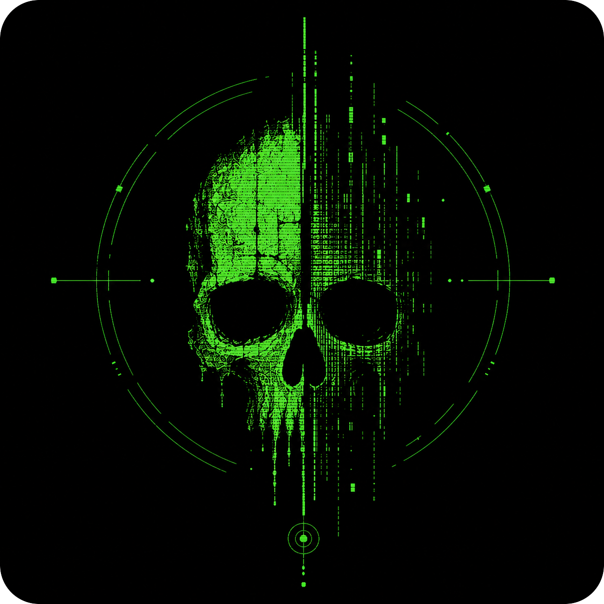
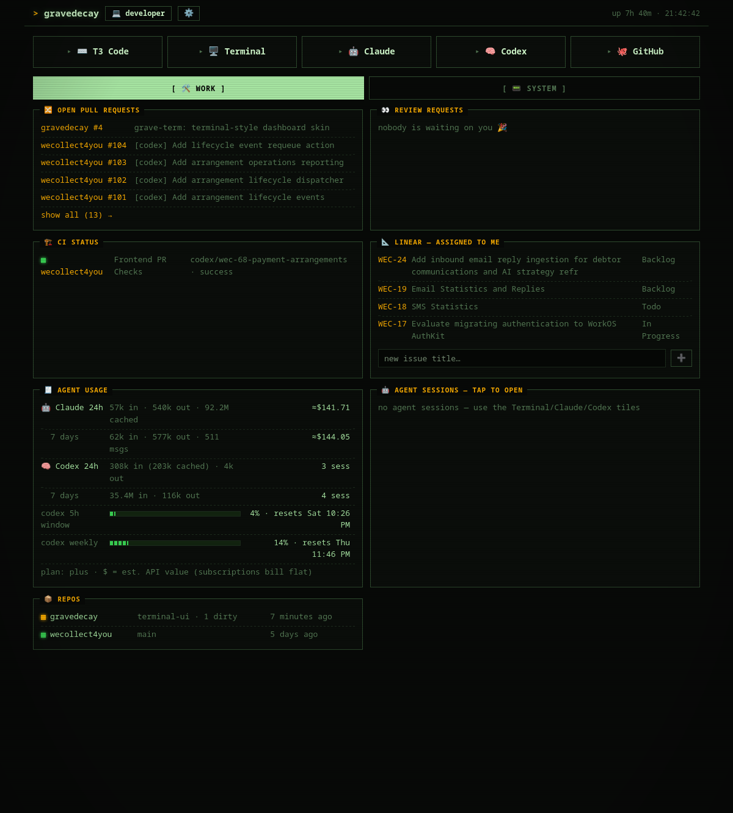
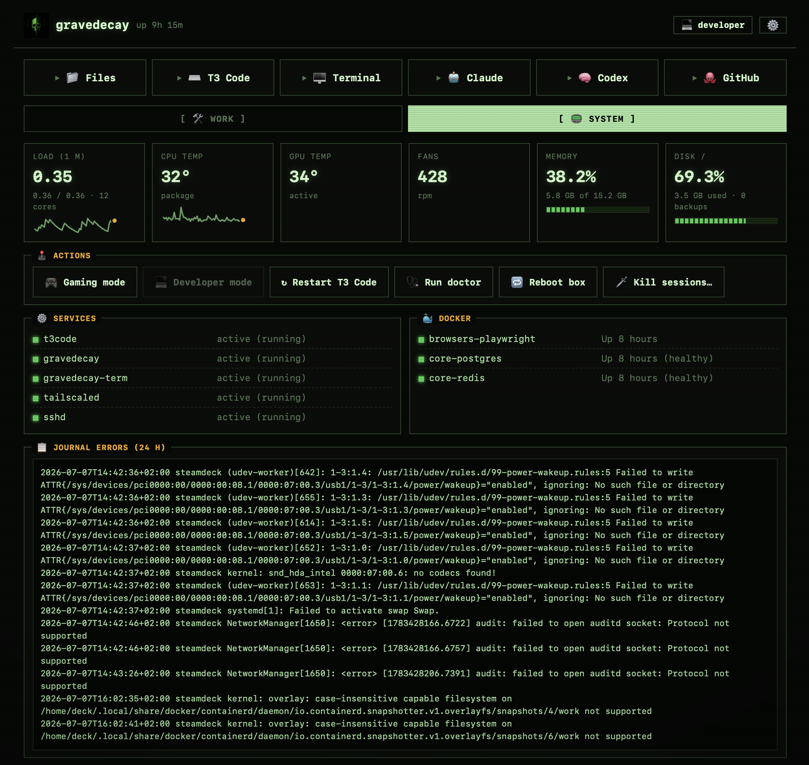

# gravedecay



**Turn any Linux box into an always-on AI dev appliance. The box never sleeps — your agents work the graveyard shift.** 🪦

gravedecay converts a spare machine (old laptop, mini PC, Steam Machine) into a
personal, tailnet-only AI development server: your repos, databases, and coding
agents live on it 24/7, while your laptops, phones, and tablets become thin
clients. Gaming keeps priority — one tap flips the box between *developer*
and *gaming* mode, freezing your agent sessions in place until you're done.

```
        ┌─────────────────────────────── the box ─────────────────────────────────┐
        │                                                                         │
        │  systemd (native, no containers)           docker (backing svcs only)   │
        │  ├─ gravedecay.service  dashboard :4712    ├─ postgres  127.0.0.1:5432  │
        │  ├─ t3code.service      web UI    :4711    ├─ redis     127.0.0.1:6379  │
        │  ├─ gravedecay-term     ttyd      :4713    └─ playwright browsers       │
        │  └─ tmux -L agents      persistent claude/codex/shell sessions          │
        │                                                                         │
        │  /srv/dev/{repos,agents,docker,config,logs,scripts,backups,docs}        │
        │  grave <cmd> — one CLI to rule the box                                  │
        └────────────────────────────┬────────────────────────────────────────────┘
                                     │ tailscale serve — ONE https origin:
                                     │   /grave = gravedecay   / = T3   /term = terminal
                     ┌───────────────┼───────────────┐
                  laptop           iPhone          iPad
                     └── gravedecay PWA (/grave/) — THE entry point ──┘
```




## Design principles

1. **Native first.** Agent CLIs, the web UI, the terminal, and the dashboard
   run as plain systemd services on the host — agents need real files, real
   processes, real builds. Docker is only for backing services.
2. **Tailnet-only.** Everything binds `127.0.0.1`; the only ways in are
   Tailscale (`tailscale serve` for the HTTPS origin, Tailscale SSH as
   fallback) and key-only sshd. Firewall is default-deny. No port
   forwarding, ever.
3. **Gaming keeps priority.** `grave gaming` frees RAM/GPU; remote access and
   the dashboard stay up. Two tiers: 🧊 freeze agent sessions in place
   (cgroup freezer — RAM kept, provably zero CPU) or ☠️ kill them for
   maximum headroom.
4. **Agent-operated.** The scripts do the deterministic 90 %; a coding agent
   (Claude Code, Codex, …) handles the box-specific 10 %. `AGENTS.md` is the
   playbook you point your agent at.
5. **Everything is a file under `$GRAVE_ROOT`** (default `/srv/dev`) — repos,
   configs, logs, backups, docs. Snapshot-friendly (btrfs+snapper supported,
   not required).
6. **Doctor is the contract.** Every invariant the platform relies on is a
   `grave doctor` check; a quirk doctor can't see will silently regress.

## Quickstart

### The agent way (recommended)

SSH into the fresh box, install your coding agent, and say:

> Clone `https://github.com/projectmushroom/gravedecay`, read `AGENTS.md`,
> and raise this box. Host profile: `<generic | t2-macbook | steam-machine>`.

The agent runs the ritual, fixes distro quirks, walks you through the two
interactive steps (Tailscale login, T3 pairing), and hands you a passing
`grave doctor`.

### The one-liner

```sh
curl -fsSL https://raw.githubusercontent.com/projectmushroom/gravedecay/master/install.sh | bash -s -- --profile generic
```

Clones to `$GRAVE_ROOT/repos/gravedecay`, checks out the **latest release**,
and runs the ritual. `GRAVEDECAY_CHANNEL=edge` follows main instead.

### The manual way

```sh
git clone https://github.com/projectmushroom/gravedecay
cd gravedecay
./raise.sh --profile generic      # idempotent; uses sudo as needed
grave doctor                      # verify every invariant
```

Requirements: a systemd-based distro (Arch-family is first-class; Debian/Fedora
best-effort), ~8 GB RAM, and a [Tailscale](https://tailscale.com) account
(free tier is fine).

### Updating

```sh
grave upgrade           # pull the latest release tag, re-run the ritual
grave upgrade --edge    # follow main instead (UPGRADE_CHANNEL=edge to default)
```

`raise.sh` is idempotent, so updating *is* re-raising: your config is never
clobbered (conf, stacks, and secrets are create-if-missing), while services,
templates, and the dashboard refresh — and doctor verifies the result.
Releases are plain git tags (`v0.1.0`, …) with notes on GitHub: pin to them
for stability, or ride main if the box is also where you hack on gravedecay.

## Connecting a device (phone, laptop, tablet)

The box is reachable **only** over your Tailscale network — there is no
public URL and no port forwarding. Every device you want to use it from
needs Tailscale installed and switched on:

1. **Install the Tailscale app** on the client:
   [iOS](https://apps.apple.com/app/tailscale/id1470499037) ·
   [Android](https://play.google.com/store/apps/details?id=com.tailscale.ipn) ·
   [macOS](https://tailscale.com/download/macos) ·
   [Windows](https://tailscale.com/download/windows) ·
   [Linux](https://tailscale.com/download/linux)
2. **Sign in with the same account** you used when raising the box
   (`tailscale up` during `raise.sh`). Same account = same tailnet = the
   device can see the box.
3. **Toggle the VPN on** in the app. On iOS/Android it's the big switch;
   on desktop it's the menu-bar/tray icon. If it's off, nothing on the box
   resolves — this is the #1 "it's broken" cause.
4. **Open the dashboard**: `https://<box>.<tailnet>.ts.net/grave/` — the exact
   URL is printed by `tailscale status` on the box (the MagicDNS name), or
   check the [Tailscale admin console](https://login.tailscale.com/admin/machines).
   Add it to your Home Screen (iOS: Share → Add to Home Screen) or Dock
   (macOS Safari: File → Add to Dock).
5. **Pair T3 Code**: first time you open T3 on a new device it asks for a
   token — mint one from ⚙️ settings → **🔑 New T3 pairing token** on any
   already-paired device, and tap the printed `/pair` link on the new one.

That's it — the device now reaches the dashboard, T3, and the terminal from
anywhere (cellular included), end-to-end encrypted by the tailnet.

## The dashboard — gravedecay is the front door

Install the PWA / macOS web app from `https://<box>.<tailnet>.ts.net/grave/`.
Everything on the box is one tap from there, all same-origin so navigation
never leaves the installed app. Terminal-styled (phosphor green, TUI frames,
scanlines), split into **🛠️ Work** and **📟 System** tabs:

**Launcher** — tiles for T3 Code, Terminal, Claude, Codex, GitHub, plus any
custom tiles you add; each tile opens in-PWA or in a new tab (your choice).
Inside T3, a tiny corner pill (installed-app mode only) brings you back.

**Work tab**
- 🔀 **Pull requests** — open PRs across your repos, 👀 marker where your
  review is requested
- 📐 **Linear** — issues assigned to you + one-line quick-create
- 🏗️ **CI status** — latest workflow run per repo
- 🧾 **Agent usage** — Claude & Codex token spend from local logs (24h/7d),
  estimated API-value cost, and Codex's real 5h/weekly rate-limit meters
- 🤖 **Agent sessions** — tap a session to open it in the terminal, ✕ kills it
- 📦 **Repos** — branch, dirty state, last commit

**System tab** — vitals (CPU/GPU temps, fans, load, memory, disk), action
buttons, services, docker containers, journal errors.

**⚙️ Settings** (identity-gated, like all actions) — show/hide/reorder
widgets, manage tiles, refresh rate, **one-tap T3 pairing tokens** (mints a
15-minute token + ready `/pair` link for enrolling a new phone/laptop),
re-auth Claude/Codex/GitHub (opens the terminal running the real login flow),
Linear API key.

Mode flips and doctor runs stream their real output live into a
terminal-styled **boot console** — burial and startup sequences, line by line.

## Web terminal

`/term/` is a full terminal in the browser (ttyd + xterm.js) attached to the
same `tmux -L agents` socket as `grave agents` — close the tab, the session
lives on; browser, SSH, and phone all reach the *same* session. The Claude and
Codex tiles drop you straight into persistent CLI sessions. TUIs render
pixel-correct; on iOS the soft keyboard lacks Esc/Ctrl, so treat the phone as
a quick-look surface (T3 is the phone-friendly way to drive agents).

## Game mode

```
grave gaming          # 🧊 torpor: stop T3/docker, FREEZE agent sessions
grave gaming --kill   # ☠️ scorched earth: sessions die, maximum free RAM
grave developer       # 💻 thaw + restore everything
```

Torpor uses the **cgroup v2 freezer** (signals don't work — tmux un-stops its
children), so frozen sessions keep their RAM but provably consume zero CPU,
and resume mid-thought on wake. In game mode the dashboard swaps to a minimal
vitals view, stops calling remote APIs, and slows its polling — the resource
diet is enforced, not implied. Tailscale, SSH, dashboard, and terminal stay
up; you can always get back in.

## Daily driving

```
grave status                     # services, containers, agents, temps, disk
grave doctor                     # verify every platform invariant
grave gaming [--kill]            # 🎮 free resources (freeze or kill sessions)
grave developer                  # 💻 thaw + restore
grave agents new mybot [dir]     # persistent tmux agent session
grave agents attach mybot        # detach: Ctrl-b d — session survives
grave docker ps|up|down|logs     # stack management
grave logs t3|dash|term|<unit>   # follow logs
grave update                     # snapshot (if snapper), update pkgs/npm/images
grave backup / restore           # git bundles + configs + docker volumes
```

## What raise.sh does

Each step is idempotent — rerun it any time: packages (pacman/apt/dnf) →
`$GRAVE_ROOT` layout + `~/Projects` symlink → `grave` CLI + config → scoped
sudoers → dashboard + web terminal + T3 Code as loopback systemd services →
docker `devnet` + core stack (random postgres password) + playwright →
firewall (SSH allowed *before* enabling) → single-origin `tailscale serve`
mounts (`/`, `/grave`, `/term`) → host profile → `grave doctor`.

## Host profiles

Machine-specific quirks live in `profiles/*.sh`, applied once by
`raise.sh --profile <name>`:

- **generic** — any always-on box; masks suspend by default.
- **t2-macbook** — Intel T2 Macs: sleep masked, lid ignored, amdgpu pinned to
  a fixed DPM state (dGPU crash workaround).
- **steam-machine** — stock SteamOS (immutable rootfs). Durable toolchain under
  `$HOME` (Homebrew + rootless Docker), `GRAVE_ROOT` on `/home`, always-on, and
  games alongside — survives SteamOS updates untouched. Bootstrap once with
  `steamos-toolchain.sh`, then raise; see [docs/STEAMOS.md](docs/STEAMOS.md).

Each profile flips matching `CHECK_*` doctor flags — quirks doctor can't
verify will silently regress. Writing your own is ~20 lines; see
`profiles/README.md`.

## Secrets & MCP for your agents

Per-integration secrets live in `$GRAVE_ROOT/config/secrets/*.env`
(git-ignored, `chmod 600`) and reach T3-spawned agent sessions via a systemd
drop-in — the same Linear/GitHub/whatever key serves both your Claude and
Codex sessions. Prefer API-key/bearer auth over OAuth: the box is headless.
The full pattern (with a worked Linear MCP example, registered in both CLIs)
is in `docs/SECRETS.md`.

## Docs

| Doc | What |
|---|---|
| [AGENTS.md](AGENTS.md) | Playbook for the coding agent doing the install |
| [docs/STEAMOS.md](docs/STEAMOS.md) | Raising on stock SteamOS (immutable rootfs): durable toolchain, update-survival |
| [docs/ARCHITECTURE.md](docs/ARCHITECTURE.md) | Why native-first, layout, mode model |
| [docs/SECURITY.md](docs/SECURITY.md) | Threat model, tailnet-only, sudoers scope, terminal trust |
| [docs/SECRETS.md](docs/SECRETS.md) | Secrets + MCP wiring for agent CLIs |
| [docs/PORTS.md](docs/PORTS.md) | Every port, documented or it doesn't exist |
| [docs/RECOVERY.md](docs/RECOVERY.md) | Backup/restore procedures |

## License

MIT. The name is the vibe: quiet box in the corner, daemons in the dirt,
shipping while you sleep. 🪦
